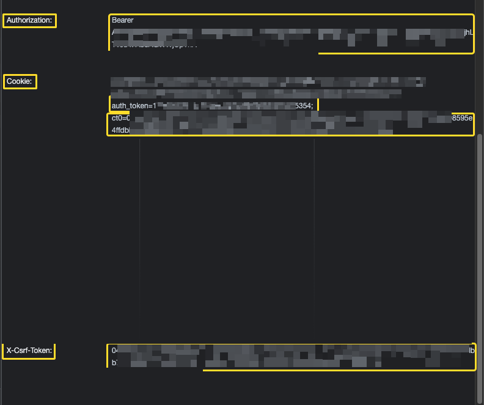

## تحتاج عشان تستعمل الأداة الAPI Key الخاص بالحساب العادي والcookies والX-Csrf-Token من الnetwork في الdevtools



### من الcookies تحتاج الauth_token والct0

#

## طريقة استعمالها

```python
from TweetToText import TweetToText

fullText = TweetToText("https://twitter.com/ahmedrowaihi/status/1512393945296343046?s=46").getTweetData()['fullText']
print(fullText)

>>outputs: 📌📌❤️ يارب https://t.co/PDAQFakjbK 
```
